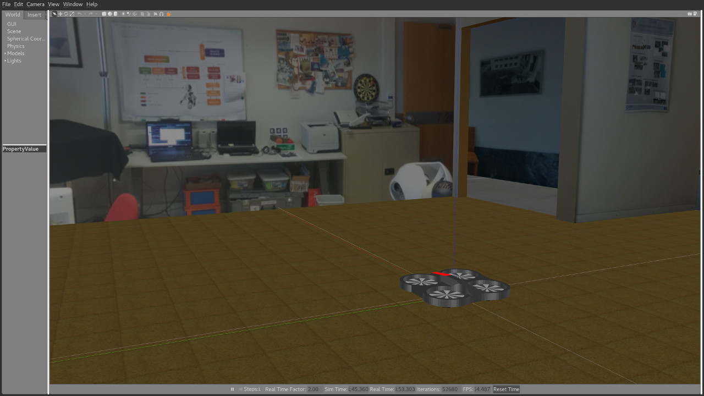

# ardrone_gazebo
Gazebo simulator test environment for the Parrot ArDrone. The world is a simulated version of the ISR 7th floor. The ArDrone model is based on the implementation of a gazebo simulator for the Ardrone 2.0 written by Hongrong Huang and Juergen Sturm of the Computer Vision Group at the Technical University of Munich (http://wiki.ros.org/tum_simulator). 

## Packages Description

TODO

## Environment

* Operating System (one of the two)
  * [Ubuntu 14.04](http://releases.ubuntu.com/trusty/) - or newer
* Middleware
  * [ROS](http://www.ros.org/) - depending on the installed OS (Indigo, Jade or Kinetic)
* Other Dependencies
  * [GAZEBO](http://gazebosim.org/) - It needs GAZEBO 5 or newer

At any time you might need to install some more specific dependencies (like some missing ROS packages). Please open an issue in case you can't solve these or other dependencies.

## Download and Setup

### 1 - Install ROS
Install ros full desktop following the installation instructions on the official ros website: www.ros.org (tested on indigo, jade and kinetic)

### 2 - Install the ardrone_autonomy package
If you are on Ubuntu simply write on your console:

    $ sudo apt-get install ros-<your-ros-distribution>-ardrone_autonomy

### 3 - Install gazebo5 or newer
If you are using ros indigo install gazebo5, 6 or 7 from the osrfoundation repository. look at this page for more details: http://gazebosim.org/tutorials?tut=ros_wrapper_versions

### 4 - Create a catkin workspace
If you don't have it already, create a catkin workspace folder (for more informations look at this link: http://wiki.ros.org/ROS/Tutorials/InstallingandConfiguringROSEnvironment):

    $ mkdir catkin_ws

Create a folder named src inside it:

    $ cd catkin_ws
    $ mkdir src

Run catkin_init_workspace inside the src directory:

    $ cd src
    $ catkin_init_workspace

Now source your new setup.bash file inside your .bashrc:

    $ echo "source <your_catkin_ws_directory>/devel/setup.bash" >> ~/.bashrc
    $ source ~/.bashrc

### 5 - Clone the git repository
Clone the git repository inside your catkin workspace src directory:

    $ cd <your_catkin_ws_directory>/src
    $ git clone https://github.com/vislab-tecnico-lisboa/ardrone_gazebo.git

## Compile

In order to compile the packages just run the following commands:

    $ cd <your_catkin_ws_directory>
    $ catkin_make

## Run

To launch the simulator run ardrone_vislab launcher using roslaunch:

    $ roslaunch ardrone_vislab_gazebo ardrone_vislab.launch

## Issues

All kind of issues and contributions will be very welcome. Please get in touch on [our issues page](https://github.com/vislab-tecnico-lisboa/ardrone_gazebo/issues) when help is needed!

